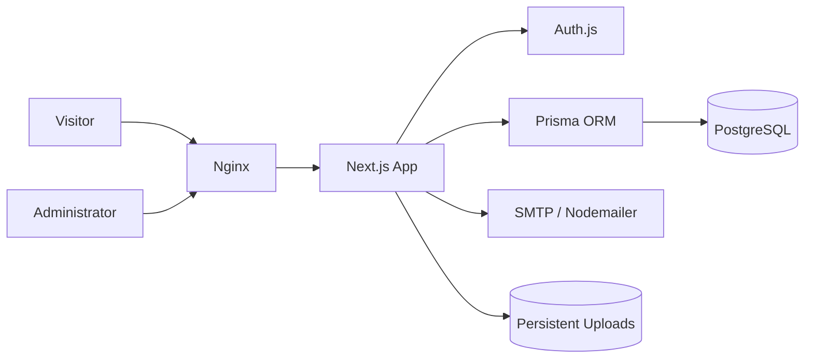

<div align="center">

# `<RB />` Personal Portfolio

### A bilingual portfolio, publishing platform, and content management system

وب‌سایت شخصی دوزبانه رضا برزخی با پنل مدیریت اختصاصی، وبلاگ، رزومه، نمونه‌کار و فرم تماس

[](https://nextjs.org/)
[](https://www.typescriptlang.org/)
[](https://www.postgresql.org/)
[](https://www.docker.com/)

</div>

---

<div dir="rtl">

## معرفی

این پروژه بازنویسی کامل وب‌سایت شخصی من از وردپرس به یک برنامه مدرن و مستقل است. هویت بصری و پالت تیره نسخه قبلی حفظ شده، اما ساختار فنی، سرعت، تجربه کاربری، مدیریت محتوا و قابلیت توسعه آن از ابتدا طراحی شده‌اند.

سایت دارای نسخه فارسی راست‌چین و نسخه انگلیسی چپ‌چین است. تمام محتوای اصلی از پنل مدیریت اختصاصی قابل ویرایش است و برای مدیریت روزمره نیازی به تغییر مستقیم کد وجود ندارد.

## امکانات اصلی

- نسخه کامل فارسی و انگلیسی
- پوسته روشن و تیره با ذخیره انتخاب کاربر
- صفحه اصلی، درباره من، نمونه‌کارها، وبلاگ، رزومه و تماس
- صفحه مستقل برای هر پروژه و مقاله
- پنل مدیریت محافظت‌شده
- مدیریت اطلاعات شخصی، مهارت‌ها، سوابق و شبکه‌های اجتماعی
- مدیریت پروژه‌ها و وضعیت انتشار آن‌ها
- مدیریت پیام‌های فرم تماس
- ذخیره پیام‌ها در پایگاه داده و ارسال اختیاری ایمیل
- بارگذاری تصویر و فایل رزومه روی فضای پایدار
- نقشه سایت، فایل راهنمای خزنده‌ها و فراداده شبکه‌های اجتماعی
- طراحی واکنش‌گرا برای موبایل، تبلت و دسکتاپ

## پنل مدیریت

پنل به بخش‌های مستقل تقسیم شده است:

| بخش | کاربرد |
|---|---|
| پیشخوان | آمار محتوا و آخرین پیام‌ها |
| اطلاعات اصلی | معرفی، تصاویر، تماس و شبکه‌های اجتماعی |
| مهارت‌ها | میزان تسلط و ترتیب نمایش |
| نمونه‌کارها | پروژه‌ها، فناوری‌ها و پیوندها |
| مقاله‌ها | فهرست، پیش‌نویس، انتشار و ویرایش |
| رزومه | سوابق کاری و آموزشی |
| پیام‌ها | مشاهده، خواندن و حذف پیام‌های تماس |

## ویرایشگر مقاله

ویرایشگر اختصاصی مقاله برای محتوای فارسی و انگلیسی امکانات زیر را ارائه می‌دهد:

- تیتر و زیرتیتر
- متن درشت و مورب
- فهرست معمولی و شماره‌دار
- نقل‌قول و قطعه کد
- درج پیوند و تصویر
- بازگشت و انجام دوباره
- شمارش واژه و تخمین زمان مطالعه
- تصویر شاخص و متن جایگزین
- دسته‌بندی و برچسب‌ها
- تنظیم عنوان و توضیحات موتور جست‌وجو
- نشانی مرجع، مقاله منتخب و کنترل نمایه‌سازی
- انتخاب زمان و وضعیت انتشار

محتوای تولیدشده پیش از نمایش پاک‌سازی می‌شود تا قالب‌بندی مجاز حفظ و کدهای اجرایی ناامن حذف شوند.

</div>

## Architecture



## Technology Stack

| Layer | Technology |
|---|---|
| Framework | Next.js App Router |
| Language | TypeScript |
| UI | React and Tailwind CSS |
| Database | PostgreSQL |
| ORM | Prisma |
| Authentication | Auth.js credentials |
| Validation | Zod |
| Email | Nodemailer |
| Reverse proxy | Nginx |
| Deployment | Docker Compose |

## Project Structure

```text
portfolio/
├── deploy/                 # Nginx, deploy, backup, and restore scripts
├── prisma/                 # Database schema, migrations, and seed data
├── public/uploads/         # Persistent user uploads
├── src/
│   ├── app/                # Public pages, admin pages, and server actions
│   ├── components/         # UI, forms, editor, navigation, and cards
│   └── lib/                # Database, validation, email, and sanitization
├── tests/                  # Automated content and validation tests
├── docker-compose.yml
└── Dockerfile
```

## Quick Start with Docker

### Requirements

- Docker Engine with Docker Compose
- Git

### Setup

```bash
git clone https://github.com/rezabarzakhi/portfolio.git
cd portfolio
cp .env.example .env
```

Replace every placeholder in `.env`, especially these values:

```dotenv
POSTGRES_PASSWORD="use-a-strong-password"
AUTH_SECRET="generate-a-long-random-secret"
ADMIN_EMAIL="admin@example.com"
ADMIN_USERNAME="admin"
ADMIN_PASSWORD="use-a-strong-password"
NEXT_PUBLIC_SITE_URL="https://example.com"
```

Build and start the complete stack:

```bash
chmod +x deploy/*.sh
./deploy/deploy.sh
```

Database migrations and initial seed data run automatically before the application starts.

## Local Development

```bash
npm ci --legacy-peer-deps
npm run db:generate
npm run db:deploy
npm run db:seed
npm run dev
```

Public website:

```text
http://localhost:3000/fa
http://localhost:3000/en
```

Administration panel:

```text
http://localhost:3000/admin/login
```

## Environment Variables

| Variable | Required | Description |
|---|---:|---|
| `DATABASE_URL` | Yes | PostgreSQL connection string |
| `POSTGRES_PASSWORD` | Yes | Docker database password |
| `AUTH_SECRET` | Yes | Session signing secret |
| `ADMIN_EMAIL` | Yes | Administrator email |
| `ADMIN_USERNAME` | Yes | Administrator username |
| `ADMIN_PASSWORD` | Yes | Administrator password |
| `NEXT_PUBLIC_SITE_URL` | Yes | Canonical production URL |
| `SMTP_HOST` | No | SMTP server hostname |
| `SMTP_PORT` | No | SMTP server port |
| `SMTP_USER` | No | SMTP username |
| `SMTP_PASSWORD` | No | SMTP password |
| `MAIL_FROM` | No | Sender address |
| `CONTACT_TO` | No | Contact form destination |

Never commit `.env`. Only `.env.example` belongs in source control.

## Available Commands

```bash
npm run dev          # Development server
npm run build        # Production build
npm run start        # Production server
npm run lint         # ESLint checks
npm run typecheck    # TypeScript checks
npm test             # Automated tests
npm run db:generate  # Generate Prisma Client
npm run db:deploy    # Apply production migrations
npm run db:seed      # Create initial content and administrator
```

## Backup and Restore

Create a timestamped database and uploads backup:

```bash
./deploy/backup.sh
```

Restore both database and uploads:

```bash
./deploy/restore.sh \
  data/backups/database-TIMESTAMP.dump \
  data/backups/uploads-TIMESTAMP.tar.gz
```

## Quality and Security

- Server-side validation for public and administrative forms
- Password hashing with bcrypt
- Protected administration routes
- HTML sanitization for rich article content
- Upload type and size validation
- Contact form rate limiting and honeypot protection
- Automated migration before application startup
- Persistent database and upload volumes

Run all quality checks before deployment:

```bash
npm run lint
npm run typecheck
npm test
npm run build
```

## Deployment Notes

The included Compose stack runs PostgreSQL, the Next.js application, an initialization job, and Nginx. Before routing production traffic:

1. Set the production domain in `.env`.
2. Configure SMTP if email notifications are required.
3. Add TLS certificates with Certbot or the VPS certificate manager.
4. Schedule `deploy/backup.sh` with cron.
5. Back up both PostgreSQL data and `data/uploads` off-site.

---

<div align="center">

Built and maintained by [Reza Barzakhi](https://github.com/rezabarzakhi)

</div>
